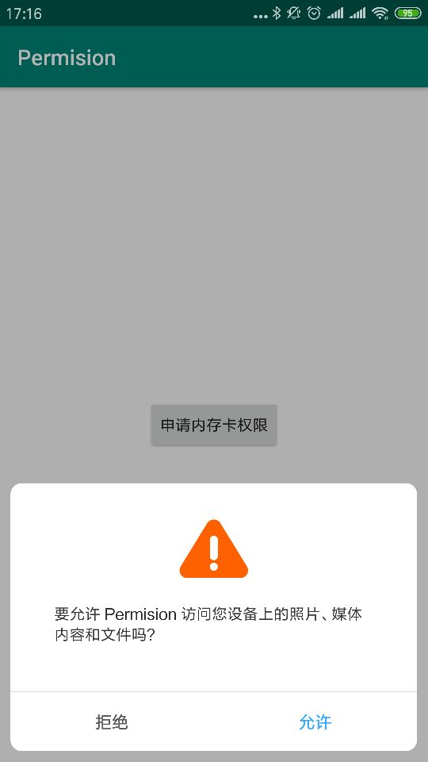

# Permission
6.0权限申请类，用于权限申请。

### 引入

```
allprojects {
		repositories {
			...
			maven { url 'https://jitpack.io' }
		}
	}


implementation 'com.github.wenkency:permission:1.2.0'

```

### 使用方式
```
// 1. 拒绝后弹吐司，显示到设置页面的Dialog
XPermission.with(this)
        .permissions(Permission.STORAGE)
        .showSetting(true) // 设置显示设置页面Dialog，默认拒绝后不显示
        .request(new PermissionListenerAdapter() {
            @Override
            public void onSucceed() {
                Log.e("TAG", "申请STORAGE成功");
            }

            @Override
            public void onFailed(boolean isCue) {
                super.onFailed(isCue);
                Log.e("TAG", "Permission.STORAGE:" + isCue);
            }
        });
// 2. 拒绝后不弹吐司，不显示到设置页面的Dialog
XPermission.with(this)
        .permissions(Permission.PHONE)
        .showToast(false)// 拒绝后不弹吐司提示
        .request(new PermissionListenerAdapter() {
            @Override
            public void onSucceed() {
                Log.e("TAG", "申请PHONE成功");
            }

            @Override
            public void onFailed(boolean isCue) {
                Log.e("TAG", "Permission.PHONE:" + isCue);
            }
        });
// 3. 拒绝后弹吐司，不显示到设置页面的Dialog
XPermission.with(this)
        .permissions(Permission.CAMERA)
        .request(new PermissionListenerAdapter() {
            @Override
            public void onSucceed() {
                Log.e("TAG", "申请CAMERA成功");
            }

            @Override
            public void onFailed(boolean isCue) {
                Log.e("TAG", "Permission.CAMERA:" + isCue);
            }
        });

```

### 运行结果

